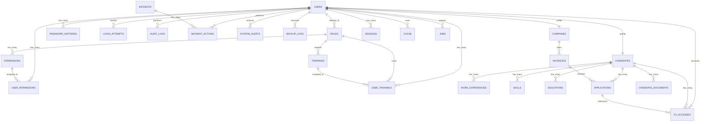

# Diagrama Entidad-Relación (ER) - CVConnect MX

## Descripción General
Este documento contiene el diagrama de base de datos completo de CVConnect MX en formato Mermaid, optimizado para ser importado en draw.io.

---

## Diagrama ER Completo

---

## Descripción de Entidades

### Gestión de Usuarios y Autenticación

#### **USERS**
- `id` (PK): Identificador único
- `uuid`: UUID único del usuario
- `email` (UNIQUE): Correo electrónico del usuario
- `password`: Contraseña encriptada
- `name`: Nombre del usuario
- `last_name`: Apellido del usuario
- `role_id` (FK): Referencia a roles
- `email_verified_at`: Timestamp de verificación de email
- `two_factor_secret`: Secreto para autenticación de dos factores
- `two_factor_recovery_codes`: Códigos de recuperación 2FA
- `two_factor_confirmed_at`: Confirmación de 2FA
- `failed_login_attempts`: Intentos de login fallidos
- `locked_until`: Timestamp de bloqueo de cuenta
- `is_active`: Estado activo/inactivo
- `remember_token`: Token de recuerdo de sesión
- `created_at`, `updated_at`: Timestamps
- `deleted_at`: Soft delete

#### **ROLES**
- `id` (PK): Identificador único
- `name` (UNIQUE): Nombre del rol
- `description`: Descripción del rol
- `active`: Estado activo/inactivo
- `created_at`, `updated_at`: Timestamps

#### **PERMISSIONS**
- `id` (PK): Identificador único
- `code` (UNIQUE): Código único del permiso
- `description`: Descripción del permiso
- `module`: Módulo al que pertenece
- `created_at`, `updated_at`: Timestamps

#### **PERMISSION_ROLE** (Tabla de Unión)
- `role_id` (FK, PK): Referencia a roles
- `permission_id` (FK, PK): Referencia a permisos
- `created_at`, `updated_at`: Timestamps

#### **USER_PERMISSIONS**
- `id` (PK): Identificador único
- `user_id` (FK): Referencia a usuarios
- `permission_id` (FK): Referencia a permisos
- `type`: Enum (granted/denied)
- `granted_by` (FK): Usuario que otorgó el permiso
- `created_at`, `updated_at`: Timestamps

#### **PASSWORD_HISTORIES**
- `id` (PK): Identificador único
- `user_id` (FK): Referencia a usuarios
- `password_hash`: Hash de contraseña anterior
- `created_at`, `updated_at`: Timestamps

#### **LOGIN_ATTEMPTS**
- `id` (PK): Identificador único
- `email`: Email del intento
- `ip_address`: Dirección IP
- `is_successful`: Booleano de éxito
- `failure_reason`: Razón del fallo
- `created_at`, `updated_at`: Timestamps

#### **SESSIONS**
- `id` (PK): Identificador único de sesión
- `user_id` (FK): Referencia a usuarios
- `ip_address`: Dirección IP de la sesión
- `user_agent`: User agent del navegador
- `payload`: Datos de la sesión
- `last_activity`: Última actividad

---

### Gestión de Candidatos

#### **CANDIDATES**
- `id` (PK): Identificador único
- `user_id` (FK, UNIQUE): Referencia a usuarios
- `professional_title`: Título profesional
- `summary`: Resumen/biografía del candidato
- `city`: Ciudad del candidato
- `expected_salary`: Salario esperado (decimal)
- `phone_encrypted`: Teléfono encriptado
- `ssn_encrypted`: SSN encriptado
- `tax_id_encrypted`: ID impuesto encriptado
- `is_public_profile`: Perfil público o privado
- `cv_url`: URL del CV
- `is_blocked`: Candidato bloqueado
- `ai_rating`: Calificación de IA (0-100)
- `ai_analysis_summary`: Resumen del análisis de IA
- `created_at`, `updated_at`: Timestamps

#### **WORK_EXPERIENCIES**
- `id` (PK): Identificador único
- `candidate_id` (FK): Referencia a candidatos
- `company_name`: Nombre de la empresa
- `job_title`: Puesto de trabajo
- `start_date`: Fecha de inicio
- `end_date`: Fecha de fin (nullable)
- `created_at`, `updated_at`: Timestamps

#### **SKILLS**
- `id` (PK): Identificador único
- `candidate_id` (FK): Referencia a candidatos
- `name`: Nombre de la habilidad
- `level`: Nivel (básico, intermedio, avanzado)
- `created_at`, `updated_at`: Timestamps

#### **EDUCATIONS**
- `id` (PK): Identificador único
- `candidate_id` (FK): Referencia a candidatos
- `institution`: Institución educativa
- `degree`: Título obtenido
- `created_at`, `updated_at`: Timestamps

#### **CANDIDATE_DOCUMENTS**
- `id` (PK): Identificador único
- `candidate_id` (FK): Referencia a candidatos
- `name`: Nombre del documento
- `file_path`: Ruta del archivo
- `slug` (UNIQUE): Slug único del documento
- `created_at`, `updated_at`: Timestamps

---

### Gestión de Empresas y Vacantes

#### **COMPANIES**
- `id` (PK): Identificador único
- `user_id` (FK, UNIQUE): Referencia a usuarios
- `name`: Nombre de la empresa
- `sector`: Sector industrial
- `internal_tax_id`: ID impuesto interno
- `is_verified`: Empresa verificada
- `city`: Ciudad de la empresa
- `state`: Estado/Provincia
- `created_at`, `updated_at`: Timestamps

#### **VACANCIES**
- `id` (PK): Identificador único
- `company_id` (FK): Referencia a empresas
- `title`: Título de la vacante
- `description`: Descripción del puesto
- `requirements`: Requisitos del puesto
- `work_model`: Modelo de trabajo (presencial, remoto, híbrido)
- `min_salary`: Salario mínimo (decimal, nullable)
- `max_salary`: Salario máximo (decimal, nullable)
- `show_salary`: Mostrar salario en anuncio
- `status`: Estado de la vacante
- `published_at`: Fecha de publicación
- `expires_at`: Fecha de expiración
- `created_at`, `updated_at`: Timestamps

---

### Gestión de Aplicaciones

#### **APPLICATIONS**
- `id` (PK): Identificador único
- `candidate_id` (FK): Referencia a candidatos
- `vacancy_id` (FK): Referencia a vacantes
- `is_offer`: Indicador si es oferta
- `cover_letter`: Carta de presentación
- `status`: Estado de la aplicación
- `rating`: Calificación (decimal 0-100)
- `internal_notes`: Notas internas
- `created_at`, `updated_at`: Timestamps

#### **CV_ACCESSES**
- `id` (PK): Identificador único
- `candidate_id` (FK): Referencia a candidatos
- `accessed_by` (FK): Usuario que accedió (referencia a users)
- `application_id` (FK): Referencia a aplicaciones (nullable)
- `created_at`, `updated_at`: Timestamps

---

### Auditoría y Seguridad

#### **AUDIT_LOGS**
- `id` (PK): Identificador único
- `user_id` (FK): Usuario que realiza la acción (nullable)
- `action`: Tipo de acción realizada
- `entity_type`: Tipo de entidad afectada (polimórfica)
- `entity_id`: ID de la entidad afectada
- `old_data`: Datos anteriores (JSON)
- `new_data`: Datos nuevos (JSON)
- `ip_address`: Dirección IP de origen
- `result`: Resultado de la acción
- `created_at`, `updated_at`: Timestamps

#### **INCIDENTS**
- `id` (PK): Identificador único
- `type`: Tipo de incidente
- `level`: Nivel (low, medium, high)
- `status`: Estado del incidente
- `description`: Descripción del incidente
- `affected_user_id` (FK): Usuario afectado (referencia a users, nullable)
- `evidence`: Evidencia (JSON)
- `detected_at`: Timestamp de detección
- `lessons_learned`: Lecciones aprendidas
- `created_at`, `updated_at`: Timestamps

#### **INCIDENT_ACTIONS**
- `id` (PK): Identificador único
- `incident_id` (FK): Referencia a incidentes
- `action`: Acción tomada
- `phase`: Fase del incidente
- `performed_by` (FK): Usuario que realizó la acción (nullable)
- `created_at`, `updated_at`: Timestamps

#### **SYSTEM_ALERTS**
- `id` (PK): Identificador único
- `type`: Tipo de alerta
- `level`: Nivel de alerta
- `message`: Mensaje de alerta
- `user_id` (FK): Usuario destinatario (nullable)
- `is_resolved`: Alerta resuelta
- `reviewed_by` (FK): Usuario que revisó (nullable)
- `created_at`, `updated_at`: Timestamps

---

### Mantenimiento y Operaciones

#### **BACKUP_LOGS**
- `id` (PK): Identificador único
- `type`: Tipo de respaldo
- `frequency`: Frecuencia del respaldo
- `destination_path`: Ruta de destino
- `size_bytes`: Tamaño en bytes
- `checksum_sha256`: Checksum SHA256
- `is_encrypted`: Respaldo encriptado
- `status`: Estado del respaldo
- `restoration_tested`: Prueba de restauración realizada
- `retention_days`: Días de retención
- `executed_by` (FK): Usuario que ejecutó (nullable)
- `created_at`, `updated_at`: Timestamps

#### **TRAININGS**
- `id` (PK): Identificador único
- `title`: Título del entrenamiento
- `type`: Tipo de entrenamiento
- `target_role_id` (FK): Rol objetivo (referencia a roles, nullable)
- `validity_days`: Días de validez
- `is_active`: Entrenamiento activo
- `created_at`, `updated_at`: Timestamps

#### **USER_TRAININGS**
- `id` (PK): Identificador único
- `user_id` (FK): Referencia a usuarios
- `training_id` (FK): Referencia a entrenamientos
- `status`: Estado del entrenamiento
- `score`: Calificación (decimal, nullable)
- `completed_at`: Fecha de completación (nullable)
- `expires_at`: Fecha de expiración (nullable)
- `created_at`, `updated_at`: Timestamps

---

### Tablas del Sistema

#### **CACHE**
- `key` (PK): Clave del cache
- `value`: Valor almacenado
- `expiration`: Timestamp de expiración

#### **CACHE_LOCKS**
- `key` (PK): Clave de bloqueo
- `owner`: Propietario del bloqueo
- `expiration`: Timestamp de expiración

#### **JOBS**
- `id` (PK): Identificador único
- `queue`: Cola de trabajo
- `payload`: Datos del trabajo (JSON)
- `attempts`: Intentos realizados
- `reserved_at`: Timestamp reservado
- `available_at`: Timestamp disponible
- `created_at`: Timestamp creación

#### **JOB_BATCHES**
- `id` (PK): Identificador único de lote
- `name`: Nombre del lote
- `total_jobs`: Total de trabajos
- `pending_jobs`: Trabajos pendientes
- `failed_jobs`: Trabajos fallidos
- `failed_job_ids`: IDs de trabajos fallidos (JSON)
- `options`: Opciones (JSON)
- `cancelled_at`: Timestamp de cancelación
- `created_at`: Timestamp creación
- `finished_at`: Timestamp finalización

#### **PASSWORD_RESET_TOKENS**
- `email` (PK): Email para resetear contraseña
- `token`: Token de reseteo
- `created_at`: Timestamp creación

---

## Guías para usar el Diagrama en draw.io

### Importar desde Mermaid

1. **Opción 1: Usar draw.io directamente**
   - Abre [draw.io](https://www.draw.io)
   - File → New
   - Selecciona "Blank Diagram"
   - Extensions → Mermaid
   - Pega el código Mermaid del diagrama arriba

2. **Opción 2: Convertir a imagen/código**
   - Usa [mermaid.live](https://mermaid.live)
   - Pega el código Mermaid
   - Exporta como imagen o SVG
   - Importa en draw.io

3. **Opción 3: Usar directamente en aplicaciones que soporten Mermaid**
   - Notion, Obsidian, GitHub, Confluence
   - GitLab, Jira, etc.

---

## Cardinalidad de Relaciones

- `||` = Una y solo una
- `|o` = Cero o una
- `o|` = Una o más
- `||` = Muchos a muchos (representado por unión)

---

## Relaciones Clave

### Jerarquía de Acceso
- Users → Roles → Permissions
- Users ← User_Permissions (Permisos específicos de usuario)

### Flujo de Aplicación
- Candidates → Applications ← Vacancies ← Companies
- Applications → CV_Accesses ← Users

### Auditoría y Seguridad
- Users → Audit_Logs
- Users → Incidents ← Incident_Actions
- Users → System_Alerts
- Users → Backup_Logs

### Capacitación y Desarrollo
- Roles ← Trainings → Users (a través de User_Trainings)

---

## Notas Importantes

- **Soft Deletes**: La tabla `users` implementa soft deletes (`deleted_at`)
- **Encriptación**: Los campos `phone_encrypted`, `ssn_encrypted`, `tax_id_encrypted` contienen datos sensibles encriptados
- **Datos JSON**: `audit_logs.old_data` y `audit_logs.new_data` almacenan datos en formato JSON
- **Polimorfismo**: `audit_logs` usa `entity_type` y `entity_id` para registrar cambios en diferentes entidades
- **Timestamps**: Todas las tablas tienen `created_at` y `updated_at` (Laravel convention)
- **Foreign Keys**: Las claves foráneas tienen `onDelete('cascade')` o `onDelete('set null')` según corresponda

---

**Última actualización**: 2026-05-06
**Versión de Laravel**: v13
**Versión de PHP**: 8.4
